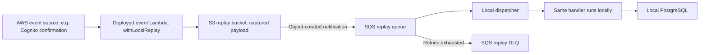

# Shared AWS dependencies during development

Development is a hybrid environment. React, application HTTP/WebSocket handlers,
container services/tasks, workflow orchestration, and agents/tools execute locally.
Authentication and real AWS event delivery remain in AWS. Managed AWS resources
used by application logic also remain in AWS.

This describes the current `PROD_DEPLOYMENT=false` graph, not a full cloud
deployment used for production-parity testing. See
[Development](DEV-DEPLOYMENT.md) for setup and
[Shared functions](SHARED-FUNCTIONS.md) for the APIs that use these resources.

## Base AWS dependencies

| Service | Why development uses it | Scope |
| --- | --- | --- |
| **Cognito** | Real user pool, app client, domain, sign-up/sign-in, token refresh, and token verification. Local application handlers consume the same Cognito identities. | Core authentication dependency in both modes. |
| **Lambda** | AWS invokes the declared event handlers. Cognito's pre-sign-up and custom-message triggers execute in AWS; the post-confirmation trigger captures an invocation for local replay. | Event Lambdas exist in both modes. Routed application handlers execute locally in dev. |
| **S3** | Store captured event payloads and callback completions that AWS workers cannot deliver directly to a private local runner. | The replay bucket is development-only infrastructure. |
| **SQS** | Receive replay-bucket object notifications; local dispatchers consume them. A replay dead-letter queue holds deliveries that exhaust retries. | The replay queue and DLQ are development-only infrastructure. |
| **IAM** | Roles and policies for deployed event Lambdas, replay access, integration bridges, and the developer's AWS API access. | Supporting permissions in both modes; local direct SDK calls use development credentials. |
| **CloudWatch Logs** | Logs for deployed Lambdas and development integration bridges. Local application logs remain in Docker or the local processes. | Supporting observability, not a replacement for local logs. |

For ordinary authenticated application development, the functional cloud base is
**Cognito + event Lambdas + S3/SQS replay**, with AWS permissions. The current
deployment also includes the workflow fixtures and bridge described below.

CloudFormation and the CDK bootstrap asset infrastructure support deploying and
exporting this graph. They are setup/deployment dependencies, rather than services
every application request invokes. The generated local resource manifest supplies
identifiers; application code does not query CloudFormation on every call.

## Development-only event capture and replay

Only handlers declared `localReplay: true` take the capture path. In the current
application that includes `cognito-post-confirmation-trigger`, which provisions
the local database user after Cognito confirms sign-up. Triggers that must decide
or customize Cognito's synchronous response still execute in AWS.

The capture wrapper returns the Cognito event to Cognito; local business processing
happens afterward. Production executes the handler normally and does not build
the replay stack. Replay is a development delivery mechanism, not proof of
production delivery guarantees.

The bucket expires objects after seven days. Failed replay deliveries move to the
DLQ after five receives; `npm run replay:list` and `npm run replay:redrive` support
inspection and retry after a fix. The DLQ retains messages for fourteen days,
which does not extend the lifetime of their payload objects in S3.

The same bucket/notification/dispatcher route can carry callback completions from
AWS workers back to local workflows. A worker on the local Compose network can
instead send its callback directly to the local runner.

Source: [replay stack](../cdk-app/lib/framework/dev-lambda-replay-stack.ts),
[capture wrapper](../packages/framework/src/runtime/event-replay.ts),
[callback runtime](../packages/framework/src/runtime/callbacks.ts), and
[Cognito event declarations](../framework-config/events/cognito.ts).

## Managed AWS dependencies selected by features

| Service | When it is needed locally |
| --- | --- |
| **DynamoDB, SQS, SNS, EventBridge** | A local workflow or workload uses a deployed table, queue, topic, or bus. Dedicated DSL integrations make real SDK calls using development credentials. These services are not emulated by the local workflow interpreter. |
| **Step Functions** | A local workflow uses `aws.call()` or `http.request()`. Development creates a small Express integration bridge per referenced operation/connection; the local runner starts it synchronously. Ordinary local workflow orchestration runs in the interpreter. |
| **EventBridge Connections** | An `http.request()` step uses a bound connection. AWS owns the connection's authentication and executes the request through its development bridge. An event bus alone does not require a Connection. |
| **SSM Parameter Store** | A declared AWS operation reads or writes parameters; the current capability-check fixture reads one through a bridge. |
| **Secrets Manager** | Deployment needs a declared cloud secret, or a local workload reads a stack-owned secret. Locally, raw `resource.secret("NAME")` contents come from authored `cdk-app/.env`; stack-owned secret contents are fetched from AWS. Local Postgres does not require an RDS credential secret. |
| **Bedrock** | Application model calls select `bedrock` or `bedrock-mantle`. LangGraph currently defaults to `bedrock-mantle`, so its AI calls need AWS model access unless configured for OpenAI. Running the service locally does not run the model locally. |
| **SES** | Cognito is configured with a custom SES sender. Otherwise it uses its built-in email sender; an independently configured SES identity is optional. |
| **Other application AWS services** | Explicit application stacks and operations use them, such as S3 document storage or Textract document analysis. They are feature dependencies, not automatic framework requirements. |

Generic AWS-operation bridges preserve the binding's IAM role. HTTP bridges also
preserve Connection-owned credentials. Production compiles those operations into
the application workflow instead of creating separate development bridges.

Source: [local workflow execution](FRAMEWORK.md#local-execution-of-a-workflow),
[bridge stack](../cdk-app/lib/framework/workflow-bridges-stack.ts),
[local environment resolution](../packages/framework/src/local/environment.ts),
[LangGraph declaration](../framework-config/services/langgraph.ts), and
[Cognito stack](../cdk-app/lib/app/cognito-stack.ts).

## Extra resources in the current dev graph

The current CDK entry point always instantiates `WorkflowFixturesStack` in dev
mode. It creates a **DynamoDB table, SQS queue, SNS topic, EventBridge bus, and SSM
parameter** for `capability-check`. That workflow also uses a development Express
bridge for `ssm:GetParameter`.

These fixture resources exist in this checkout's dev deployment even if everyday
UI development does not use them. They exercise framework capabilities; they are
not universal requirements for every application built with the framework.

`ReferenceExampleStack` is an example class and catalog entry, but the current CDK
entry point does not instantiate it. Its document bucket, stream, schedule, and
other example constructs therefore do not belong in the deployed baseline list.

Source: [CDK entry point](../cdk-app/bin/cdk-app.ts),
[fixture stack](../cdk-app/lib/app/workflow-fixtures-stack.ts), and
[capability workflow](../framework-config/workflows/capabilities.ts).

## What development runs locally

| Production surface | Development execution |
| --- | --- |
| RDS / RDS Proxy | Compose PostgreSQL and local database access. |
| CloudFront and website hosting | Vite and its same-origin proxy. |
| HTTP API Gateway and routed Lambdas | Local API server and Lambda executor. |
| WebSocket API Gateway and routed Lambdas | Local WebSocket server and Lambda executor. |
| ECS services, ECS tasks, and application load balancers | Compose services and dynamically launched Docker tasks. |
| Application Step Functions state machines | Local workflow interpreter; AWS bridges only for the advanced integrations above. |
| AgentCore Runtime and Gateway | Local agent session processes and Gateway emulation. Tools run through the local Lambda executor. Cognito and any model/AWS API calls remain external dependencies. |

A dev deployment publishes no ECS task/service images. AWS event Lambdas and
CDK-created support providers can still require deployment assets; local compute
does not mean deployment is asset-free.

The echo-agent sample is local-only. Developing it does not require a deployed
AgentCore Runtime or Gateway. Live AWS parity checks are a separate deployment
and verification action.

Source: [deployment mode table](FRAMEWORK.md),
[composition factories](../cdk-app/lib/framework/framework-composition.ts),
[Compose](../docker-compose.yml), and
[sample agent declaration](../framework-config/agents/example.ts).
